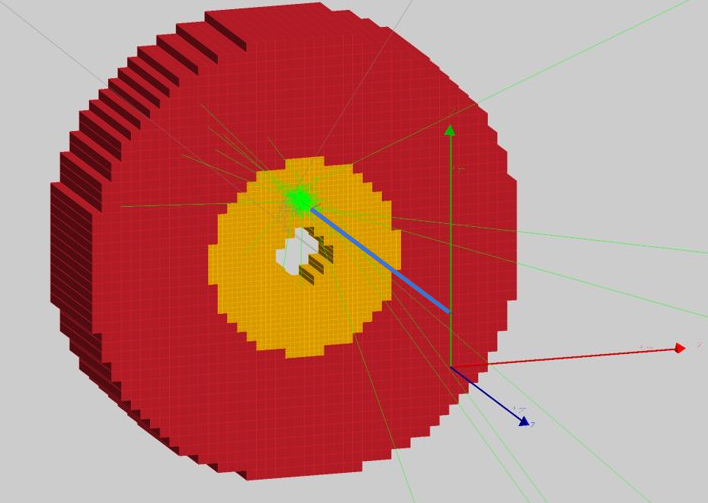

# CaloGan

# Spacial Thanks
Dmitry Romanov

## Data

- shower_geant3_new.zip
- Geant3 generated crystal calorimeter 
- ~900 000
- Data is validated with Primex, Gluex and other experiments (Eta prime)
- 11x11 calorimeter
- Each line is an event
- x, y e, and then for each cell - deposit, cell row, cell column
- All hits are in cell with id 0,0
- The idea of the data to be a shower library

Example of event

```
ROW   0     1     2     3     4     5     6     7     8     9     10    11
-----------------------------------------------------------------------------
0   | 0.0   0.0   0.0   0.0   0.0   0.0   0.0   0.0   0.0   0.0   0.0   0.0
1   | 0.0   0.0   0.0   0.0   0.0   0.0   0.0   0.0   0.0   0.0   0.0   0.0
2   | 0.0   0.0   0.0   0.0   0.0   0.0   0.0   0.69  0.0   0.0   0.0   0.0
3   | 0.0   0.0   0.0   0.69  0.0   0.0   1.4   0.0   0.0   0.0   0.0   0.0
4   | 0.0   0.0   0.0   1.8   3.3   2.9   3.5   2.2   0.0   0.0   0.0   0.0
5   | 0.0   0.0   2.1   1.8   3.6   7.4   5.0   2.2   1.6   0.0   0.0   0.0
6   | 0.0   0.0   0.0   1.6   3.6   5.0   4.0   1.4   0.0   0.0   0.0   0.0
7   | 0.0   0.0   0.69  1.8   2.2   3.0   2.5   1.4   0.0   0.0   0.0   0.0
8   | 0.0   0.0   0.0   0.0   1.8   1.8   0.69  0.0   0.0   0.0   0.0   0.0
9   | 0.0   0.0   0.0   0.0   0.0   0.0   0.0   0.0   0.0   0.0   0.0   0.0
10  | 0.0   0.0   0.0   0.0   0.0   0.0   0.0   0.0   0.0   0.0   0.0   0.0
11  | 0.0   0.0   0.0   0.0   0.0   0.0   0.0   0.0   0.0   0.0   0.0   0.0
-----------------------------------------------------------------------------
```

